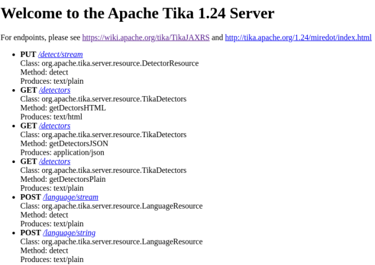

# System specification
* [java 11](https://jdk.java.net/11/)
* [spring boot 2.3](https://spring.io/blog/2020/08/13/spring-boot-2-3-3-available-now)
## Build the application
Cloud Native Buildpacks are used to build the application
``` 
./mvnw spring-boot:build-image
```
## Run the application
The single command is enough to start the whole application
```
docker-compose up
```
## Optical Character Recognition
The Ocr process is being processed by [Apache Tika](https://tika.apache.org/1.24/index.html) that uses [Google Tesseract](https://opensource.google/projects/tesseract) 
under the hood. The ocr uses the [OkHttpClient](https://square.github.io/okhttp) to create the http call to Apache Tika Server 

### Start the server
To start the Apache Tika server just type a command 
``` 
docker-compose up
```
We can check if the servers are running through the URL [tika on localhost](http://localhost:9998/) as seen in the following image .
### Languages in Tesseract OCR
In the standard installation, the languages available in Tesseract are English (default), French, German, Italian, and Spanish. To add new ones, we need to access the container terminal through Docker and execute the following commands to install, for example, the Polish language. The correct choice of the text language allows greater precision in character recognition.
```
docker exec -it tika-server-ocr /bin/bash
apt-get update
apt-get install tesseract-ocr-por
```
###More reading
To read more about Tika ocr check this [blog post](https://medium.com/@masreis/text-extraction-and-ocr-with-apache-tika-302464895e5f)

###OCR in action
to see how the ocr process works in practice just send the sample file using curl
```
curl -X POST "http://localhost:8080/ocr" -H "accept: */*" -H "Content-Type: multipart/form-data" -F "fileToOcr=@someDoc.jpg;type=image/jpeg"
```
You can use also the swagger dashboard [swagger-ui](http://localhost:8080/swagger-ui/)
### Processing document with specific language
There is a language parameter in Ocr Api. It can be null than the Apache Tika tries to detect the language.
The language can be specified in request - for instance (pl, en). Here is [list of languages](https://github.com/TakahikoKawasaki/nv-i18n/blob/master/src/main/java/com/neovisionaries/i18n/LanguageCode.java).
Sometimes it improves the quality of ocr process.
``` 
curl -X POST "http://localhost:8080/ocr" -H "accept: */*" -H "Content-Type: multipart/form-data" -F "fileToOcr=@doc.pdf;type=application/pdf" -F "language=pl" 
```